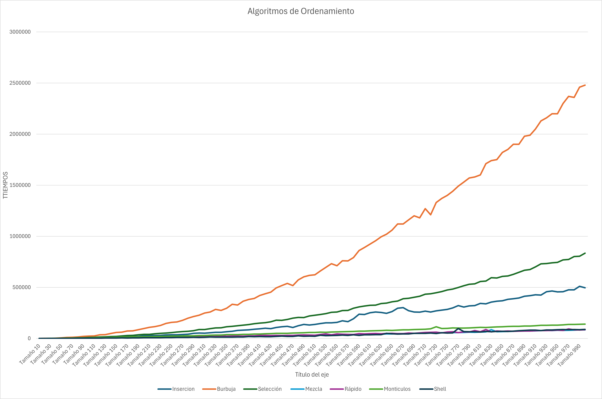

# Algoritmos de ordenamiento

Programa en C++ que ejecuta los algoritmos de ordenamiento: 

**1. Ordenamiento por Inserción**  
**2. Ordenamiento de Burbuja**  
**3. Ordenamiento por Selección**  
**4. Ordenamiento por Mezcla**  
**5. Ordenamiento Rápido**  
**6. Ordenamiento por Montículos**    
**7. Ordenamiento Shell**  

Se realiza una prueba de la efectividad de cada uno de estos algoritmos, dónde cada uno de ellos tiene que realizar varias pruebas en dónde los elementos a ordenar son números enteros generados aleatoriamente y que se encuentran entre el 1 y el 1000, comenzando con un conjunto de 10 números, el conjunto va aumentando de 10 en 10 hasta llegar a los 1000 elementos. Después de cada prueba, se guardan los tiempos en los que ha tardado cada algoritmo en ordenar el conjunto para después ser exportados a un archivo CSV. 


# Preferencias 

- **GCC (GNU Compiler Collection)**
  

# Proyecto 

```Algoritmos_Ordenamiento.cpp``` es el archivo fuente en el que se realiza todo el proceso con los algoritmos, en este archivo se encuentra tanto main como todas las funciones utilizadas que hacen posible los archivos CSV.    

```Archivos CSV``` son todos los archivos generados por los algoritmos que contienen los tiempos de estos.  

# Instalación 
1. Clonar el repositorio
``` sh
git clone https://github.com/mocejo/Algoritmos-de-ordenamiento.git
```
2. Entrar al directorio del proyecto
```sh
cd Algoritmos-de-ordenamiento
```
3. Compilar el código 
```sh
g++ Algoritmos_Ordenamiento.cpp -o Algoritmos_Ordenamiento
```
4. Ejecutar código
```sh
./Algoritmos_Ordenamiento
```

**Forma práctica:**  

Descargar el archivo ```Algoritmos_Ordenamiento.cpp``` y compilar desde un IDE a su preferencia.

# Descripción de los algoritmos

A continuación se presenta una descripción sobre cada algoritmo:

**INSERCIÓN:**

El **Ordenamiento por Inserción** es un algoritmo de clasificación simple que construye el arreglo ordenado de manera incremental, elemento por elemento. 

#### **Pasos del algoritmo:**
1. **Inicialización:**
   - Se asume que el primer elemento del arreglo ya está ordenado.
   - Se comienza desde el segundo elemento (`i = 1`) y se avanza hasta el final del arreglo.

2. **Comparación e Inserción:**
   - Para cada elemento actual (`A[i]`), se compara con los elementos anteriores en el arreglo ordenado.
   - Si el elemento actual es menor que el elemento anterior (`A[j-1]`), se desplaza el elemento anterior hacia adelante para hacer espacio para el elemento actual.

3. **Colocación:**
   - Una vez que se encuentra la posición correcta, el elemento actual se inserta en esa posición.

4. **Repetición:**
   - Este proceso se repite para todos los elementos del arreglo hasta que esté completamente ordenado.
  
**BURBUJA:**

El **Ordenamiento de Burbuja** funciona comparando pares de elementos adyacentes en un arreglo y los intercambia si están en el orden incorrecto. Este proceso se repite hasta que el arreglo esté completamente ordenado.

#### **Pasos del Algoritmo:**
1. **Inicialización:**
   - Se recorre el arreglo desde el primer elemento hasta el último.
   - Se utiliza una bandera (`intercambiado`) para verificar si se realizaron intercambios en una pasada. Si no se realizan intercambios, el arreglo ya está ordenado y el algoritmo puede detenerse.

2. **Comparación e Intercambio:**
   - Para cada par de elementos adyacentes, si el elemento actual es mayor que el siguiente, se intercambian.

3. **Repetición:**
   - El proceso se repite para todos los elementos, reduciendo el rango de comparación en cada iteración, ya que los elementos más grandes "burbujearán" hacia el final del arreglo.

4. **Optimización:**
   - Si en una pasada completa no se realiza ningún intercambio, el algoritmo termina antes de completar todas las iteraciones.
  
**SELECCION:**

El **Ordenamiento por Selección** es un algoritmo de clasificación simple que divide el arreglo en dos partes: una parte ordenada y otra no ordenada. En cada iteración, selecciona el elemento más pequeño (o más grande, dependiendo del orden deseado) de la parte no ordenada y lo coloca al final de la parte ordenada.

#### **Pasos del Algoritmo:**
1. **Inicialización:**
   - Se recorre el arreglo desde el primer elemento hasta el penúltimo.
   - En cada iteración, se asume que el primer elemento de la parte no ordenada es el más pequeño.

2. **Búsqueda del mínimo:**
   - Se busca el índice del elemento más pequeño en la parte no ordenada del arreglo.

3. **Intercambio:**
   - Si el índice del mínimo encontrado no es el índice actual, se intercambian los elementos.

4. **Repetición:**
   - Este proceso se repite hasta que todos los elementos estén en la parte ordenada.

**MEZCLA:**

El **Ordenamiento por Mezcla** es un algoritmo de ordenamiento que divide el arreglo en partes más pequeñas, las ordena de forma recursiva y luego combina (mezcla) las partes ordenadas para formar el arreglo final ordenado.

#### **Pasos del Algoritmo:**
1. **División:**
   - Divide el arreglo en dos mitades aproximadamente iguales.
   - Este proceso se repite recursivamente hasta que cada subarreglo tenga un solo elemento (que por definición está ordenado).

2. **Ordenamiento:**
   - Una vez que los subarreglos tienen un solo elemento, se combinan de manera ordenada.

3. **Mezcla:**
   - Se utiliza un procedimiento para mezclar dos subarreglos ordenados en un solo subarreglo ordenado.

El algoritmo está dividido en dos funciones principales: `OrdenamientoMezcla` y `Mezcla`.

**RÁPIDO:**

El **Ordenamiento Rápido** es un algoritmo de ordenamiento eficiente, es uno de los algoritmos más populares debido a su buen rendimiento promedio y su implementación relativamente sencilla.

#### **Pasos del Algoritmo:**
1. **Elección del pivote:**
   - Se selecciona un elemento del arreglo como pivote (en este caso, el último elemento del subarreglo).

2. **Partición:**
   - Se reorganizan los elementos del arreglo de manera que todos los elementos menores o iguales al pivote queden a su izquierda, y todos los elementos mayores queden a su derecha.
   - La función `Particion` realiza esta tarea y devuelve la posición final del pivote.

3. **Recursión:**
   - Se aplica el algoritmo recursivamente a los subarreglos izquierdo y derecho (excluyendo el pivote, ya que ya está en su posición final).

##### **Función `Particion`:**
Esta función organiza los elementos alrededor del pivote y devuelve su posición final.

**MONTICULOS:**

El **Ordenamiento por Montículos** es un algoritmo de ordenamiento basado en la estructura de datos conocida como **montículo binario máximo** (Max-Heap). Un montículo binario máximo es un árbol binario completo donde el valor de cada nodo es mayor o igual que los valores de sus hijos. Este algoritmo utiliza el montículo para extraer repetidamente el elemento máximo y colocarlo en su posición correcta en el arreglo.

#### **Pasos del Algoritmo:**
1. **Construcción del Montículo Máximo:**
   - Convierte el arreglo en un montículo binario máximo utilizando la función `BUILD_MAX_HEAP`.

2. **Extracción del Máximo:**
   - Intercambia el primer elemento (el mayor) con el último elemento del arreglo.
   - Reduce el tamaño del montículo y ajusta el montículo restante para mantener la propiedad de montículo máximo utilizando la función `MAX_HEAPIFY`.

3. **Repetición:**
   - Repite el proceso de extracción hasta que todos los elementos estén ordenados.

#### **Código del Algoritmo:**

##### **Función `OrdenamientoMonticulos`:**
Esta función implementa el proceso principal del algoritmo.

##### **Función `BUILD_MAX_HEAP`:**
Esta función construye el montículo máximo a partir del arreglo.

##### **Función `MAX_HEAPIFY`:**
Esta función asegura que el subárbol con raíz en el índice `i` cumpla con la propiedad de montículo máximo.


**SHELL SORT:**

El **Ordenamiento Shell** es una mejora del algoritmo de **Inserción**. Introduce la idea de comparar y mover elementos que están separados por un "gap" (brecha) en lugar de elementos adyacentes. A medida que el algoritmo avanza, el "gap" se reduce hasta que finalmente se convierte en 1, momento en el cual el algoritmo se comporta como un **Ordenamiento por Inserción**.

#### **Pasos del Algoritmo:**
1. **Inicialización del Gap:**
   - Se define un valor inicial para el "gap" (generalmente la mitad del tamaño del arreglo).

2. **Comparación y Movimiento:**
   - Para cada elemento en el arreglo, se compara con el elemento que está a una distancia igual al "gap".
   - Si el elemento actual es menor que el elemento comparado, se intercambian.

3. **Reducción del Gap:**
   - El "gap" se reduce (generalmente dividiéndolo entre 2) y el proceso se repite hasta que el "gap" sea igual a 1.

4. **Ordenamiento Final:**
   - Cuando el "gap" es 1, el algoritmo realiza un último pase utilizando el **Ordenamiento por Inserción**.


# Gráfica
En la siguiente gráfica podemos ver el rendimiento que ha tenido cada algoritmo con cada tamaño de elementos: 



# Análisis 
**Burbuja (naranja) es el más ineficiente**

- Su curva crece de forma exponencial, lo que indica que su tiempo de ejecución aumenta drásticamente con el tamaño de los datos.

- Esto confirma su complejidad O(n²), lo que lo hace poco práctico para grandes volúmenes de datos.

**Selección e Inserción tienen un rendimiento intermedio**

- Aunque también son O(n²), parecen ser más eficientes que el método de burbuja.
  
- Sus curvas crecen más lentamente, pero siguen siendo menos óptimas que otros algoritmos más avanzados.

**Quicksort, Montículos y Shell (colores morado, rosa y verde claro) son los más eficientes**
 
- Sus tiempos son notablemente menores en comparación con los demás.

- Esto es consistente con su complejidad de O(n log n) en el mejor caso, lo que los hace más adecuados para ordenar grandes cantidades de datos.

**El algoritmo de mezcla (azul claro) también tiene buen desempeño**

- Su crecimiento es bajo y constante, lo que es característico de algoritmos eficientes como Merge Sort (O(n log n)).


# Conclusión 

- Burbuja es el peor algoritmo para ordenar datos grandes.

- Quicksort, Montículos y Shell Sort son las mejores opciones si se busca eficiencia.

- Inserción y Selección pueden ser útiles para tamaños pequeños, pero no escalan bien.


